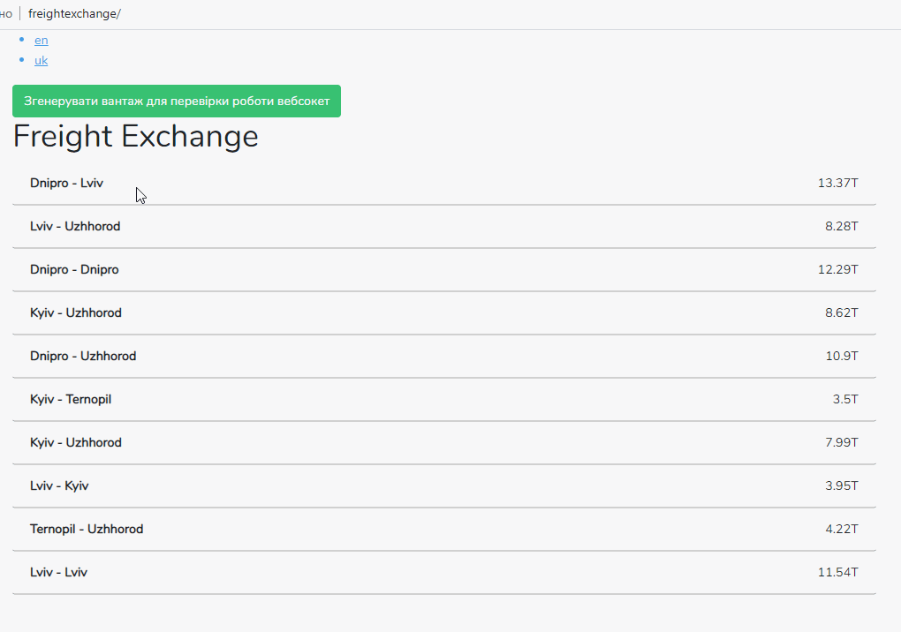

  </ p >

<a href="https://travis-ci.org/laravel/framework">  </ a>

<a href="https://packagist.org/packages/laravel/framework">  < / a>

## About “Freight Exchange”

This technical task involves creating a simple service to add and
cargo display.

## Technology stack

 ● Laravel
 ● Vue.js
 ● Bootstrap

## How to run?

git clone https://github.com/vadykoo/testFreightExchange

cd testFreightExchange

composer install

copy yourself a .env file

Create a database named freightExchangeDB

change

DB_USERNAME = root

        DB_PASSWORD =
        if needed

php artisan migrate --seed
if LoadSeeder is not executed then to comment in a load factor all that is connected with the image

php artisan storage: link

php artisan serve

running tests
vendor \ bin \ phpunit

open site

search by city is available at the address of the type
http://127.0.0.1:8000/from/dnipro
http://127.0.0.1:8000/uk/from/dnipro

you can generate a new load for web sockets
http://127.0.0.1:8000/api/generate

additionally if something does not work

npm install

npm run dev

Test name: "Cargo Exchange"Technology stack (latest stable versions):● Laravel● Vue.js● BootstrapUsing Bootstrap to make a page template, taking as a reference imageabove.
Page 2
page structureat the root is written the language in which to display content/ - show all loads in the list/ from / {city} - show in the list all loads where the route from this city (city should not be idand the slug is made on the basis of the name of the city)examples url/ uk / from / kyiv - show routes from Kyiv in Ukrainian/ uk / from / lviv - show routes from Lviv in Ukrainian/ from / lviv - show routes from Lviv in the default language/ - all routes in the default language/ uk- all routes in Ukrainianthe site is multilingual (for DB to usespatie / laravel-translatable )the photo that is added to the load must use File Storage to be able toeasy to replace driversбд-loads - cargoes-city_from_id-city_to_id-name (lang)-volume-photo-cities - cities-name (lang)-lat-lngthe logic of deployment of cargo to do on vuejs (all content should be without additional apirequests)Additional refinements (optional):-there should be a task in the schedule that creates the load and on the front through this websocketthe cargo is added to the general list-write testsThe output should be a project to run which needs to roll, migration, cider(update additional things).Pour the result into the repository on GitHub

## License

Open-sourced software licensed under the [MIT license] (https://opensource.org/licenses/MIT).
